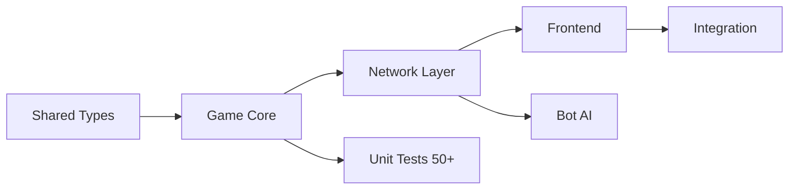

# Технический план разработки (Development Plan)

**Проект**: TMA Joker Game  
**Версия**: 1.1 (после анализа)  
**Дата**: 2026-01-22  
**Базовый документ**: [TOR.md](./TOR.md) (v0.2) — единственный источник правды  
**Детальная спецификация**: [ROADMAP.md](./ROADMAP.md)

---

## 🔴 ВНИМАНИЕ: Блокирующий вопрос

> [!CAUTION]
> **Q9 (Структура раундов/пулек)** — критическая неоднозначность!
> 
> ROADMAP описывает: Пулька 4 = "раунды 18-24 аналогично 2-8" (по 2-8 карт)
> Правила говорят: "Четвёртый круг — копия второго" (по 9 карт!)
> 
> **Требуется уточнение у заказчика ДО начала Sprint 1.**
> 
> Подробности: [OPEN_QUESTIONS.md](./OPEN_QUESTIONS.md#Q9)

---

## 📋 Обзор проекта

| Параметр | Значение |
|----------|----------|
| Бюджет | 200 000 ₽ |
| Срок | 7-8 недель (56 дней) |
| Нагрузка | 100-200 одновременных игр (400-800 WS) |
| Игроки | 4 человека + боты |
| Платформа | Telegram Mini App |

---

## 🛠️ Технологический стек

### Backend
| Технология | Версия | Назначение |
|------------|--------|------------|
| Node.js | 20+ LTS | Runtime |
| NestJS | 10+ | Фреймворк (DI, WebSocket) |
| TypeScript | 5+ | Типизация |
| Socket.io | 4+ | Real-time (автоматический реконнект) |
| Redis | 7+ | Hot Data (TTL 2 часа) |
| PostgreSQL | 15+ | Cold Data (JSONB история) |
| Jest | latest | Unit/Integration тесты |

### Frontend (TMA)
| Технология | Версия | Назначение |
|------------|--------|------------|
| React | 18+ | UI Framework |
| Vite | 5+ | Build tool |
| Telegram WebApp SDK | latest | Интеграция с Telegram |
| Socket.io-client | 4+ | WebSocket клиент |
| Zustand | latest | State management |

### DevOps
| Технология | Назначение |
|------------|------------|
| Docker + Compose | Контейнеризация |
| PM2 | Process manager (cluster mode) |
| GitHub Actions | CI/CD (опционально) |

---

## 📁 Структура проекта (Monorepo)

```
tma_game_joker/
├── apps/
│   ├── backend/               # NestJS сервер
│   │   ├── src/
│   │   │   ├── auth/          # Telegram auth
│   │   │   ├── game/          # Game Core (движок)
│   │   │   │   ├── models/
│   │   │   │   ├── validators/
│   │   │   │   ├── services/
│   │   │   │   └── tests/
│   │   │   ├── gateway/       # WebSocket Gateway
│   │   │   ├── bot/           # Bot AI
│   │   │   ├── database/      # Redis + PostgreSQL
│   │   │   └── api/           # REST API (история)
│   │   ├── test/              # E2E тесты
│   │   └── Dockerfile
│   │
│   └── frontend/              # React TMA
│       ├── src/
│       │   ├── components/
│       │   ├── pages/
│       │   ├── hooks/
│       │   ├── store/
│       │   └── socket/
│       └── Dockerfile
│
├── packages/
│   └── shared/                # Общие типы и константы
│       ├── types/             # GameState, Card, Player
│       └── constants/         # Таймауты, правила
│
├── docs/                      # Документация
├── docker-compose.yml
├── TOR.md                     # Единственный источник правды
├── ROADMAP.md                 # Детальная спецификация
└── DEVELOPMENT_PLAN.md        # Этот документ
```

---

## 🎯 Этапы разработки

### Критический путь (Dependencies)



> [!IMPORTANT]
> **Game Core** — критический путь. Без работающего движка невозможны тесты сетевого слоя и фронтенда.

---

## 📅 Sprint 0: Инициализация проекта (2-3 дня)

### Цели
- Настроить monorepo структуру
- Создать базовые конфигурации
- Настроить CI/CD (опционально)

### Задачи

| ID | Задача | Приоритет | Время |
|----|--------|-----------|-------|
| S0-1 | Создать структуру папок monorepo | MUST | 1ч |
| S0-2 | Инициализировать NestJS backend (`nest new`) | MUST | 1ч |
| S0-3 | Инициализировать React frontend (Vite) | MUST | 1ч |
| S0-4 | Создать shared package (типы) | MUST | 2ч |
| S0-5 | Настроить Docker Compose (Redis, PostgreSQL) | MUST | 2ч |
| S0-6 | Настроить ESLint, Prettier, TypeScript strict | SHOULD | 2ч |
| S0-7 | Создать .env.example + документацию | SHOULD | 1ч |

### Критерии приёмки (Definition of Done)
- [ ] `pnpm install` работает без ошибок
- [ ] `pnpm dev:backend` запускает NestJS на порту 3000
- [ ] `pnpm dev:frontend` запускает Vite на порту 5173
- [ ] `docker-compose up` поднимает Redis + PostgreSQL
- [ ] TypeScript strict mode во всех проектах

---

## 📅 Sprint 1: Game Core (2 недели)

> Соответствует **Этапу 1** в TOR.md

### Цели
Реализовать полный игровой движок (без UI и сети) с 50+ unit-тестами.

### Задачи

#### Неделя 1: Модели данных и валидация

| ID | Задача | Приоритет | Время | Ref |
|----|--------|-----------|-------|-----|
| S1-1 | Создать Enums (Suit, Rank, GamePhase, JokerOption) | MUST | 2ч | ROADMAP line 415-450 |
| S1-2 | Создать Card model (standard + joker) | MUST | 2ч | ROADMAP line 452-454 |
| S1-3 | Создать Player model | MUST | 2ч | ROADMAP line 457-477 |
| S1-4 | Создать GameState model | MUST | 3ч | ROADMAP line 479-508 |
| S1-5 | Реализовать DeckService (create, shuffle, deal) | MUST | 3ч | ROADMAP line 807-941 |
| S1-6 | Реализовать MoveValidator | MUST | 4ч | ROADMAP line 577-659 |
| S1-7 | Реализовать BetValidator | MUST | 3ч | ROADMAP line 662-705 |
| S1-8 | Написать тесты на валидаторы (20+ тестов) | MUST | 6ч | ROADMAP line 1757-1877 |

#### Неделя 2: Игровая логика

| ID | Задача | Приоритет | Время | Ref |
|----|--------|-----------|-------|-----|
| S1-9 | Реализовать StateMachine (переходы фаз) | MUST | 4ч | ROADMAP line 527-573 |
| S1-10 | Реализовать ScoringService (очки, штанга) | MUST | 4ч | ROADMAP line 707-804 |
| S1-11 | Реализовать PremiumCalculator (премии пульки) | MUST | 5ч | ROADMAP line 742-786 |
| S1-12 | Реализовать GameEngineService (orchestrator) | MUST | 6ч | — |
| S1-13 | Реализовать "Тузование" (определение раздающего) | MUST | 2ч | Rules doc line 91 |
| S1-14 | Написать тесты на scoring (20+ тестов) | MUST | 6ч | — |
| S1-15 | Написать тесты на Joker rules (10+ тестов) | MUST | 4ч | ROADMAP line 1796-1816 |

### Критерии приёмки (TOR REQ)
- [ ] **50+ unit-тестов** проходят (`pnpm test:backend`)
- [ ] Корректный подсчет очков по таблице (AC4.1-4.6)
- [ ] Валидация ходов: масть → козырь → сброс (AC3.1)
- [ ] Джокер: High/Low/Top/Bottom (AC3.2-3.4)
- [ ] Правило "вынужденного" (AC2.2)
- [ ] Механика "Тузования" (AC1.2)

---

## 📅 Sprint 2: Network Layer (2 недели)

> Соответствует **Этапу 2** в TOR.md

### Цели
WebSocket API, Reconnect, Bot fallback.

### Задачи

#### Неделя 3: WebSocket Gateway

| ID | Задача | Приоритет | Время | Ref |
|----|--------|-----------|-------|-----|
| S2-1 | Настроить Socket.io Gateway (NestJS) | MUST | 3ч | ROADMAP line 946-1056 |
| S2-2 | Реализовать TelegramAuthGuard (HMAC) | MUST | 4ч | ROADMAP line 1694-1751 |
| S2-3 | Реализовать RoomManager (очередь, комнаты) | MUST | 5ч | ROADMAP line 1221-1327 |
| S2-4 | Реализовать event handlers (find_game, join_room) | MUST | 4ч | ROADMAP line 1058-1087 |
| S2-5 | Реализовать event: make_bet | MUST | 3ч | ROADMAP line 1106-1141 |
| S2-6 | Реализовать event: throw_card | MUST | 4ч | ROADMAP line 1143-1192 |
| S2-7 | Реализовать event: select_trump | MUST | 2ч | ROADMAP line 1194-1218 |

#### Неделя 4: Reconnect + Bots

| ID | Задача | Приоритет | Время | Ref |
|----|--------|-----------|-------|-----|
| S2-8 | Реализовать Turn Timer (30 сек) | MUST | 3ч | ROADMAP line 1329-1386 |
| S2-9 | Реализовать Disconnect handling (30 сек grace) | MUST | 4ч | ROADMAP line 994-1008 |
| S2-10 | Реализовать Reconnection logic | MUST | 4ч | ROADMAP line 1014-1032 |
| S2-11 | Реализовать BotService (random valid move) | MUST | 5ч | ROADMAP line 1391-1488 |
| S2-12 | Реализовать Bot fill (60 сек timeout) | MUST | 3ч | ROADMAP line 1274-1300 |
| S2-13 | Реализовать RedisService (hot state, TTL) | MUST | 3ч | ROADMAP line 1493-1537 |
| S2-14 | Integration tests (4 клиента играют) | MUST | 6ч | — |

### Критерии приёмки (TOR REQ)
- [ ] 4 клиента могут сыграть партию через WebSocket (REQ-6.1-6.3)
- [ ] При дисконнекте игрок имеет 30 сек на переподключение (REQ-7.1)
- [ ] При переподключении игрок получает `game_state` (REQ-7.2)
- [ ] Если не переподключился — замена ботом (REQ-7.3)
- [ ] При перезагрузке (F5) — автовозврат в игру (REQ-7.4)
- [ ] Таймаут заполнения ботами: 60 сек (REQ-6.4)

---

## 📅 Sprint 3: Frontend (2-3 недели)

> Соответствует **Этапу 3** в TOR.md

### Цели
Telegram Mini App UI по макетам Figma.

### Задачи

#### Неделя 5: Базовый UI

| ID | Задача | Приоритет | Время |
|----|--------|-----------|-------|
| S3-0 | Анализ макетов Figma, извлечение дизайн-системы | MUST | 4ч |
| S3-1 | Настроить Telegram WebApp SDK | MUST | 2ч |
| S3-2 | Настроить Socket.io клиент + auth | MUST | 3ч |
| S3-3 | Создать Zustand store для GameState | MUST | 3ч |
| S3-4 | Создать компонент Card (отображение карты) | MUST | 4ч |
| S3-5 | Создать компонент Hand (карты игрока) | MUST | 4ч |
| S3-6 | Создать компонент Table (центр стола) | MUST | 4ч |
| S3-7 | Создать компонент PlayerInfo (4 игрока) | MUST | 3ч |

#### Неделя 6: Игровой flow

| ID | Задача | Приоритет | Время |
|----|--------|-----------|-------|
| S3-8 | Создать экран Lobby (find game, join room) | MUST | 4ч |
| S3-9 | Создать UI заказа взяток (BetModal) | MUST | 4ч |
| S3-10 | Создать UI выбора козыря (TrumpSelector) | MUST | 3ч |
| S3-11 | Создать UI выбора опции Джокера | MUST | 3ч |
| S3-12 | Реализовать drag & drop или tap для хода | MUST | 5ч |
| S3-13 | Создать таймер хода (30 сек визуально) | MUST | 2ч |

#### Неделя 7: Таблица и анимации

| ID | Задача | Приоритет | Время |
|----|--------|-----------|-------|
| S3-14 | Создать ScoreTable (пулька) | MUST | 5ч |
| S3-15 | Создать RoundResult (промежуточные результаты) | MUST | 3ч |
| S3-16 | Создать GameOver (финальная таблица) | MUST | 3ч |
| S3-17 | Анимации раздачи карт | SHOULD | 4ч |
| S3-18 | Анимации хода картой | SHOULD | 4ч |
| S3-19 | Responsive для iOS/Android/Desktop | MUST | 4ч |

### Критерии приёмки (TOR REQ)
- [ ] Интерфейс соответствует макетам Figma (REQ-5.1)
- [ ] Отображение карт на руках и на столе (REQ-5.1)
- [ ] Базовые анимации раздачи и хода (REQ-5.2)
- [ ] Удобный интерфейс заказа и выбора масти (REQ-5.3)
- [ ] Отображение таймера хода (REQ-5.4)
- [ ] Запуск в Telegram WebApp (iOS/Android/Desktop)

---

## 📅 Sprint 4: Интеграция и полировка (1 неделя + 3 дня буфер)

> Соответствует **Этапу 4** в TOR.md

### Цели
E2E тестирование, деплой на staging, исправление багов.

### Задачи

| ID | Задача | Приоритет | Время |
|----|--------|-----------|-------|
| S4-1 | E2E тест: полная партия (24 раздачи) | MUST | 8ч |
| S4-2 | Сохранение истории в PostgreSQL (JSONB) | SHOULD | 4ч |
| S4-3 | REST API: история игр | SHOULD | 3ч |
| S4-4 | Настроить production Docker Compose | MUST | 3ч |
| S4-5 | Деплой на staging | MUST | 4ч |
| S4-6 | Load testing (Artillery) | SHOULD | 4ч |
| S4-7 | Bug fixing (баг дни) | MUST | 16ч |
| S4-8 | Финальная документация | SHOULD | 4ч |

### Критерии приёмки (TOR Definition of Done)
- [ ] ✅ 50+ unit-тестов на правила
- [ ] ✅ Bot-fallback работает (через 30 сек за отключившегося ходит бот)
- [ ] ✅ Нет Race Conditions (одновременный ход обрабатывается корректно)
- [ ] ✅ Reconnect работает (F5 → автовозврат)
- [ ] ✅ Полная партия (24 раздачи) без критических багов

---

## ⚠️ Открытые вопросы (требуют решения)

> Из [OPEN_QUESTIONS.md](./OPEN_QUESTIONS.md)

| ID | Вопрос | Impact | Блокирует | Решение |
|----|--------|--------|-----------|---------|
| **Q9** | **Структура раундов/пулек** | **КРИТИЧЕСКИЙ** | Sprint 1 | **ТРЕБУЕТ ОТВЕТА ДО НАЧАЛА РАБОТ!** |
| Q6 | История игр (persistence) | Архитектура БД | Sprint 2 | Нужно уточнить с заказчиком |
| Q7 | Leaderboard | +scope | Sprint 4 | Нужно уточнить с заказчиком |
| Q8 | Гарантия/поддержка | Контракт | — | Нужно уточнить |

> [!CAUTION]
> До начала Sprint 1 необходимо закрыть **Q9** (структура раундов). Это критически влияет на игровую логику.
> До начала Sprint 2 необходимо закрыть Q6 (история игр). Это влияет на выбор хранилища.

---

## 🚨 Известные технические риски (выявлены при анализе)

### Риск 1: Логика сравнения Джокеров
**Файл**: ROADMAP.md → `compareCards()`
**Проблема**: При двух Джокерах с опцией "Top" функция не может определить "последнего" — нет информации о порядке ходов.
**Решение**: При реализации передавать индексы карт из `table[]` для определения порядка.

### Риск 2: Логика премий (несколько игроков на премии)
**Файл**: ROADMAP.md → `calculatePulkaPremiums()`
**Проблема**: Не полностью реализовано правило: "если следующий на премии — не списывать, но и не получать от предыдущего".
**Решение**: При реализации добавить двухпроходный алгоритм с учётом соседства.

### Риск 3: Джокер как козырь
**Файл**: Правила игры
**Проблема**: "Если при раздаче козырем выпал Джокер → игра без козырей". Этот кейс не описан в ROADMAP.
**Решение**: Добавить обработку в `DeckService.deal()`.

### Риск 4: Валидация Джокера High
**Файл**: ROADMAP.md → `MoveValidator`
**Проблема**: При ходе Джокером "High" другие игроки ОБЯЗАНЫ положить **высшую** карту масти. Сейчас валидируется только наличие масти, но не "высшая ли".
**Решение**: Добавить `validateResponseToJokerHigh()`.

---

## 🔗 Ссылки

- **TOR.md** — Единственный источник правды по требованиям
- **ROADMAP.md** — Детальная техническая спецификация с кодом
- **docs/Правила и механика игры Joker.md** — Правила игры
- **Figma макеты** — [ссылка](https://www.figma.com/design/9D7EzC04qqZf8sFj06lfqM/Joker?node-id=0-1)

---

## 📝 Changelog

| Версия | Дата | Описание |
|--------|------|----------|
| 1.1 | 2026-01-22 | Ревизия после анализа: добавлен блокер Q9 (структура раундов), исправлен приоритет S3-12 (MUST), добавлена задача S3-0 (анализ Figma), добавлен буфер 3 дня в Sprint 4, добавлена секция "Известные технические риски" |
| 1.0 | 2026-01-21 | Первоначальная версия плана |
